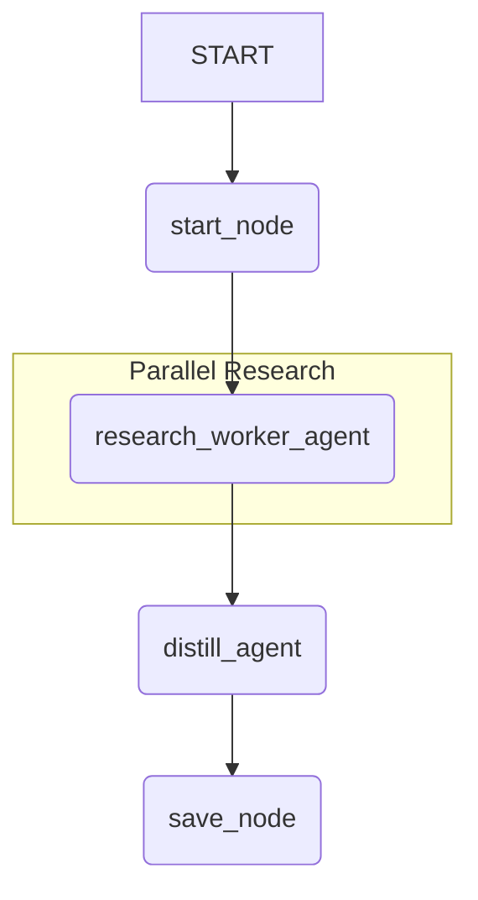
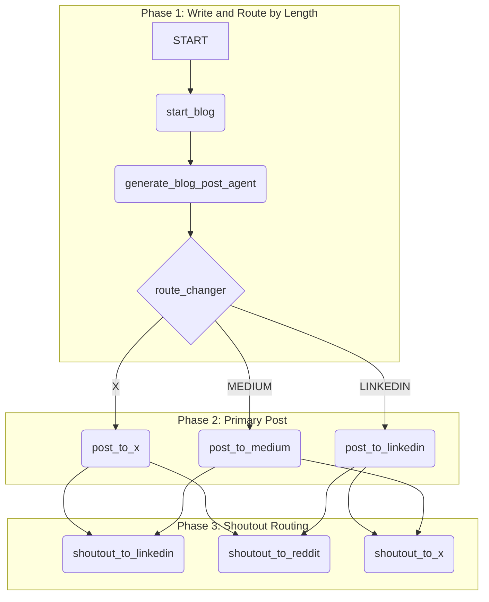

# ADK 2.0 Workflow Demo - Source

This directory contains the core source code for the ADK 2.0 Workflow Demonstration, a multi-agent application that automates content creation and publication.

## Project Architecture

The project is orchestrated by a main `root_agent` that sequences two primary sub-workflows: the **Research Workflow** and the **Blog Workflow**.

### Root Workflow
The top-level agent (`root_agent`) connects the two sub-workflows in a simple sequence:
1.  Execute the `research_workflow`.
2.  Execute the `blog_workflow`.

### Research Workflow

This workflow is responsible for gathering information on a given topic. It follows a "fan-out, fan-in" pattern:

1.  **Start (`start_node`)**: The workflow begins, receiving a research topic. It defines a list of platforms to research (e.g., X, LinkedIn, Reddit, Medium).
2.  **Parallel Research (`research_worker_agent`)**: The workflow fans out, running a separate research worker for each platform in parallel. Each worker uses a search tool to find information on the topic from its assigned platform.
3.  **Distill (`distill_agent`)**: The results from all parallel workers are fanned back in (joined). A synthesizer agent then distills these multiple summaries into a single, coherent research report.
4.  **Save (`save_node`)**: The final report is saved to the session state for later use by the Blog Workflow.



### Blog Workflow

This workflow takes the generated research and creates and publishes a blog post. It uses conditional routing to decide where and how to post content.

1.  **Generate Post (`generate_blog_post_agent`)**: An LLM agent drafts a blog post based on a given thesis and the research report generated in the previous workflow.
2.  **Route by Length (`route_changer`)**: A function node analyzes the generated post's word count and routes it to the most appropriate primary platform (X, LinkedIn, or Medium).
3.  **Primary Post**: The blog post is published to the selected primary platform.
4.  **Shoutouts**: After the primary post is successful, the workflow triggers "shoutout" posts on the other platforms to drive traffic to the main article.



## Directory Structure

-   `main.py`: The main entry point for running the application. It sets up the session and initiates the `root_agent` workflow.
-   `agent.py`: Defines the three main `WorkflowAgent`s (`root_agent`, `research_workflow`, `blog_workflow`) and constructs the graph of nodes by defining the edges between them.
-   `tools.py`: Contains mock implementations for external services, such as `execute_search` and `post_to_platform`.
-   `prompts.py`: A centralized file holding all the instructional prompts used by the `LlmAgent`s.
-   `agent_nodes/`: Contains the `LlmAgent` and `ParallelWorker` definitions.
    -   `research.py`: Defines the agents for the research phase.
    -   `publishing.py`: Defines the agent for the content generation phase.
-   `function_nodes/`: Contains the standard Python functions that are wrapped into `FunctionNode`s to be used in the workflows.
    -   `research.py`: Functions for starting the research, combining reports, and saving the output.
    -   `publishing.py`: Functions for routing blog posts and publishing them.

## User Guide: Local Deployment

Follow these instructions to set up and run the project on your local machine.

### Prerequisites

-   Python 3.10+
-   `uv` (a fast Python package installer and resolver)

If you do not have `uv`, you can install it by following the official instructions: https://github.com/astral-sh/uv

### Installation

1.  **Navigate to the project root directory.**

2.  **Create a virtual environment and install dependencies:**
    Use `uv` to sync the project dependencies from `pyproject.toml`.

    ```bash
    uv pip sync
    ```

### Running the Project

1.  **Activate the virtual environment (if not already active).** `uv` often handles this automatically, but if you need to do it manually:

    ```bash
    source .venv/bin/activate
    ```

2.  **Run the main script:**
    Execute the `main.py` script from the project's root directory.

    ```bash
    uv run python3 src/main.py
    ```

    *OR*

    Use adk web in roder to launch the locally hosted web chat interface

    ```bash
    uv run adk web
    ```

3. Give it a topic that you want it to 'investigate' and 'publish' e.g.:
<Complete a research deep dive on AI integration into schools and publish a blog discussing the topc>

### Expected Output

You will see a series of log messages printed to the console, indicating the progress of the workflow. These logs show which agent or node is currently running, the actions being taken (like performing research or posting content), and the final output of the workflows.
